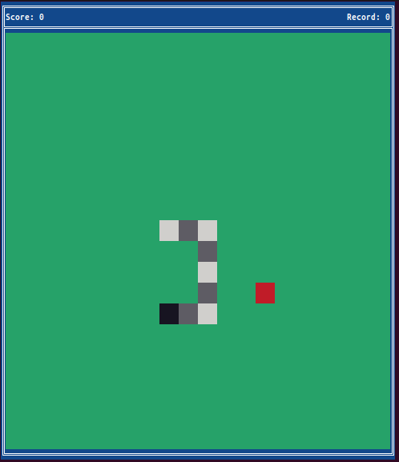
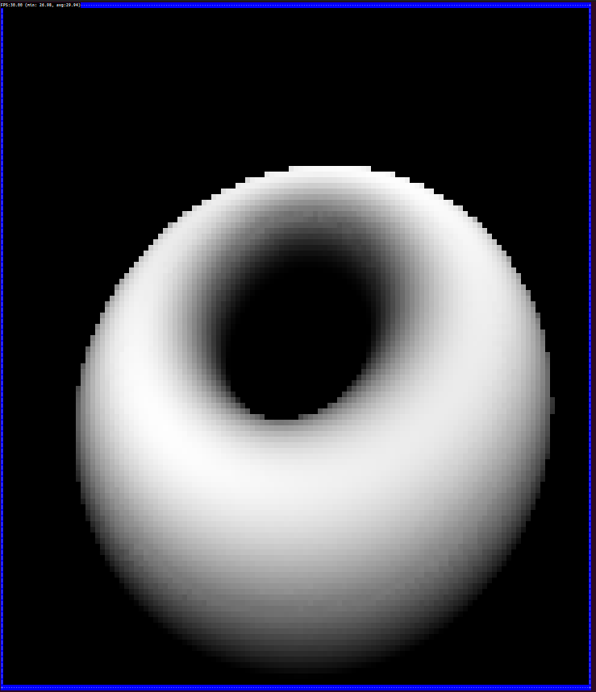

# MiniCore

**Lightweight Modular Framework for Building Console Applications in C**

## Overview

MiniCore is a streamlined framework written in pure C, designed to facilitate the development of robust and efficient console-based applications.  It provides a flexible, modular architecture centered around an interface-based component system.  MiniCore aims to offer a solid foundation for projects ranging from simple utilities to complex interactive console applications, including text-based games, now with **enhanced color fidelity across different terminal types.**

Key framework capabilities include:

*   **Modular "Object-Oriented" Architecture**: Encourages code reusability and maintainability through a component-based design.
*   **Interface-Driven Component System**:  Promotes flexibility and extensibility by defining clear contracts between modules.
*   **Enhanced Console Screen Rendering**:  Offers advanced functionalities for text-based output with color and formatting, including **full RGB color support with automatic conversion for compatibility across various terminals.**
*   **Keyboard Input Handling**:  Manages user input from the keyboard for interactive applications.

## Features

*   **Modular Core Design**: Clear separation between the core framework (`core`) and example implementations (`impl`), promoting a clean and organized project structure.
*   **Comprehensive Interface System**: The framework leverages interfaces to define object capabilities and interactions. Key interfaces include:
    *   **`CardHandler`**: Defines functionalities for objects that manage and interact with cards (relevant for card games, but can be adapted for other data management).
    *   **`Drawable`**:  Enables objects to render themselves on the console screen.
    *   **`CursorInteractable`**:  Provides mechanisms for objects to interact with a cursor, handling movement and actions.
    *   **`Dynamic`**:  Indicates objects that require dynamic memory management and defines a freeing mechanism.
    *   **`ButtonHandler`**:  Implements button-like interactions within console applications.
    *   **`PositionHandler`**:  Manages object positions and state persistence across map movements.
    *   **`Updateable`**:  Allows objects to perform periodic updates within the application loop.
    *   **`CoreDependent`**:  Provides access to core engine functionalities for dependent objects.
    *   **`InputHandler`**:  Enables direct input handling for specific objects.
    *   **`TickDependent`**:  Allows objects to synchronize actions with the framework's tick-based system.
*   **Advanced Console Screen Management**:  Supports ASCII, Unicode, and **full RGB color rendering**. The framework **automatically detects terminal color capabilities** (Truecolor, 256-color, or basic 16 colors) and **dynamically converts RGB colors to the optimal format** supported by the terminal.
*   **Optional `tput` Support**:  Leverages the `tput` utility (if available) to **query the terminal for advanced capabilities**, ensuring accurate color detection and optimal rendering.  If `tput` is not found, a fallback detection method is used.
*   **Keyboard Input Management**:  Provides utilities for capturing and processing keyboard input events.
*   **Memory Efficiency Focus**:  Emphasizes memory control with arena allocation, minimizing dynamic memory allocations by default for predictable performance.

## Example Implementations

The framework includes the following example implementations within the `impl` directory to showcase different types of console applications that can be built with MiniCore:

*   **Solitaire Game**:  A complete Klondike Solitaire card game implementation demonstrating advanced framework features like complex game logic, user interface elements (menus, win screen), Unicode card rendering, and terminal-based user interaction.

    

*   **Snake Game**: A classic Snake game implementation, illustrating game loop management, real-time input handling, and dynamic object updates within the MiniCore framework.

    

*   **Rotating 3D Donut**: A visually impressive, rotating 3D donut rendered using ASCII art and grayscale shading. This example demonstrates:

    *   **Advanced Rendering Techniques:**  Projection of a 3D object (a torus) onto a 2D terminal screen.
    *   **Real-time Animation:** Smooth rotation of the donut using frame-based updates.
    *   **Grayscale Shading:**  Dynamic calculation of brightness levels to create a 3D effect using only background colors.
    *   **Efficient Algorithms:** Optimized calculations for inverse distance (z-buffering) and normalized luminance.

    

## Building

**Clone the repository**

```bash
git clone https://github.com/gooderfreed/MiniCore.git
cd MiniCore
```

**Build the project**

To build all implementations:

```bash
make
```

To build a specific implementation (e.g., Solitaire):

```bash
cd impl/solitaire
make
```

## Usage Example

For a step-by-step guide and a basic code example demonstrating the fundamental usage of MiniCore, please refer to the [**impl/simple_demo**](impl/simple_demo/) directory. This example provides a clear illustration of how to initialize the core, create objects, implement interfaces, and integrate them into the main application loop. It serves as an excellent starting point for understanding the framework's core concepts and building your own console applications.


## License

Licensed under the MIT License. See [LICENSE](LICENSE) for details.

## Contributing

Contributions are welcome! Please feel free to submit a Pull Request.
