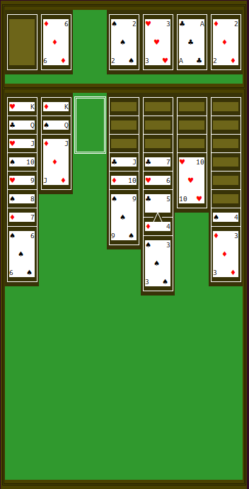

# MiniCore
A lightweight game engine written in pure C, designed for console-based card based games.

## Overview
MiniCore is a minimalistic yet powerful framework that provides:
- Flexible *"object-oriented"* architecture
- Interface-based component system
- Screen rendering capabilities
- Input handling
- Event system

## Features
- **Modular Design**: Core/Implementation separation
- **Interface System**: 
  - CardHandler
  - Drawable
  - Interactable
  - Dynamic
  - ButtonHandler
  - PositionHandler
  - Updateable
- **Screen Management**: ASCII/Unicode rendering
- **Input Handling**: Keyboard events
- **Memory Efficient**: No dynamic allocations by default

## Example Implementation
The framework comes with a Solitaire card game implementation showcasing the engine's capabilities:
- Card game mechanics
- Unicode card rendering
- Terminal-based UI\


## Building
**Clone the repository**
```bash
git clone https://github.com/gooderfreed/minicore.git
```
**Build the project**

Build all implementations
```bash
make
```
**or build a specific implementation:**

Go to the implementation directory
```bash
cd impl/solitaire
```
Build the project
```bash
make
```

## Usage
### 1. Create Your Object
First, define your object structure and initialize it with required interfaces:

```c
typedef struct MyObject {
    ObjectInterfaces interfaces;
    // Your object data
} MyObject;

MyObject init_object(void) {
    MyObject obj = {0};

    static const Drawable drawable = {
        .print = my_print_function
    };

    static const Interactable interactable = {
        .move = my_move_function,
        .place_cursor = my_place_cursor_function
    };

    obj.interfaces = (ObjectInterfaces){
        .name = "MyObject",
        .capabilities = {
            .is_drawable = true,
            .is_interactable = true
        },
        .drawable = &drawable,
        .interactable = &interactable
    };
    return obj;
}
```

### 2. Register in Object Map
Add your object to the map to make it part of the game world:

```c
MyObject my_object = init_object();
Screen   screen   = init_screen();

Map map = {
    .objects = {
        {
            {&my_object, MY_OBJECT_DEFAULT_COORDS},
            // Other objects...
        }
    },
    .global_coords = (Coords){.x = 0, .y = 0}
};

// Initialize cursor and core
MapObject object = map_get_current_object(&map);
Cursor    cursor = init_cursor(object.object, object.default_coords);
Core      core   = init_core(&map, &cursor, &screen);
```
### 3. Main Loop
Handle input and update screen:

```c
while (true) {
    wint_t input = getwchar();
    bool need_update = true;
    
    switch (input) {
        case KEY_LEFT:  core_move(&core, CURSOR_LEFT);  break;
        case KEY_RIGHT: core_move(&core, CURSOR_RIGHT); break;
        case KEY_SPACE: core_action(&core);             break;
        default: need_update = false;
    }

    if (need_update) {
        core_update_screen(&core);
    }
}
```

## License
Licensed under the MIT License. See [LICENSE](LICENSE) for details.

## Contributing
Contributions are welcome! Please feel free to submit a Pull Request.